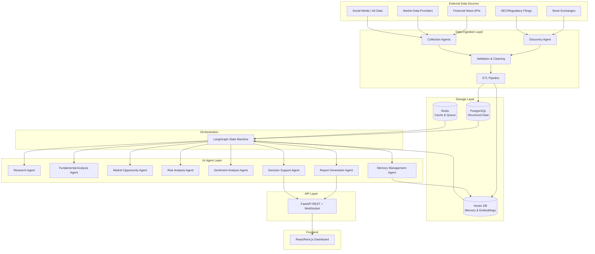
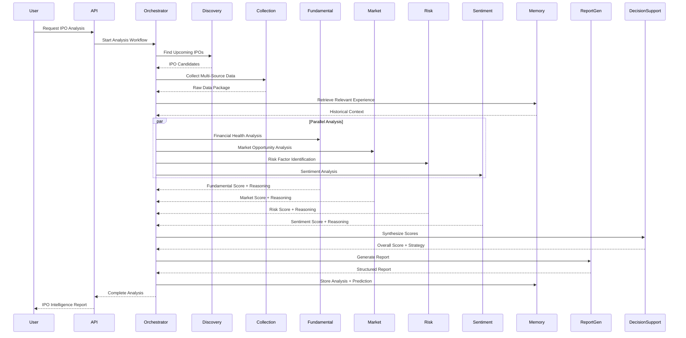
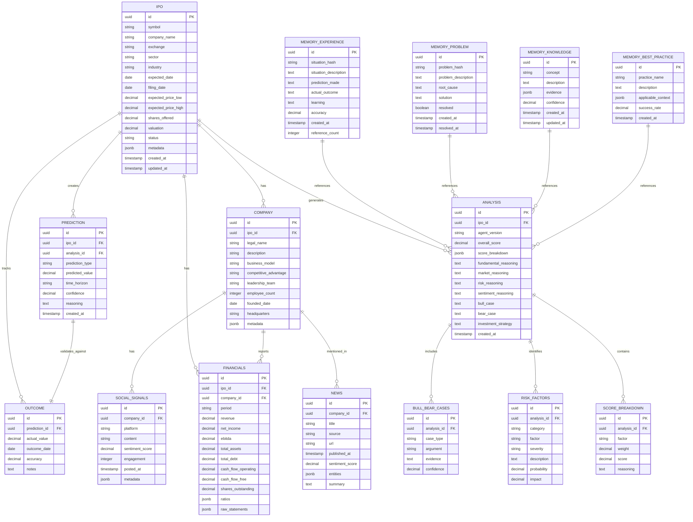
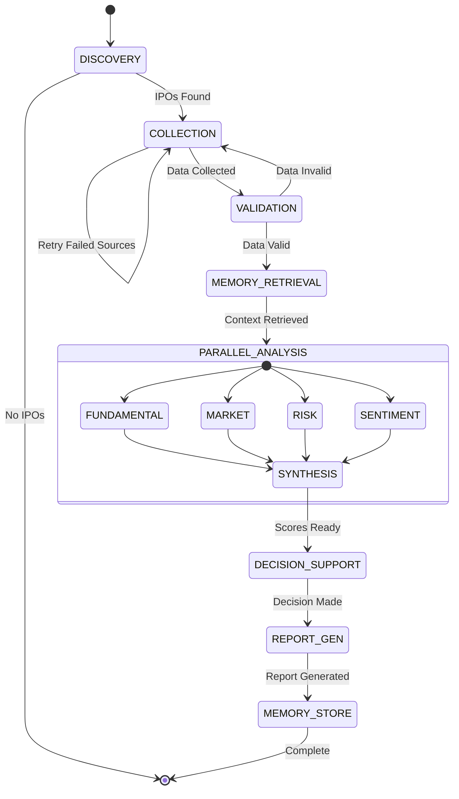
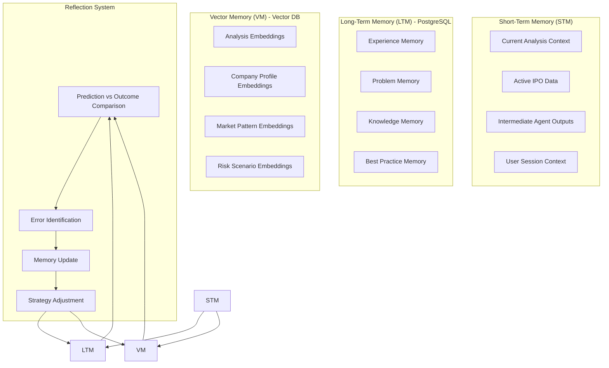
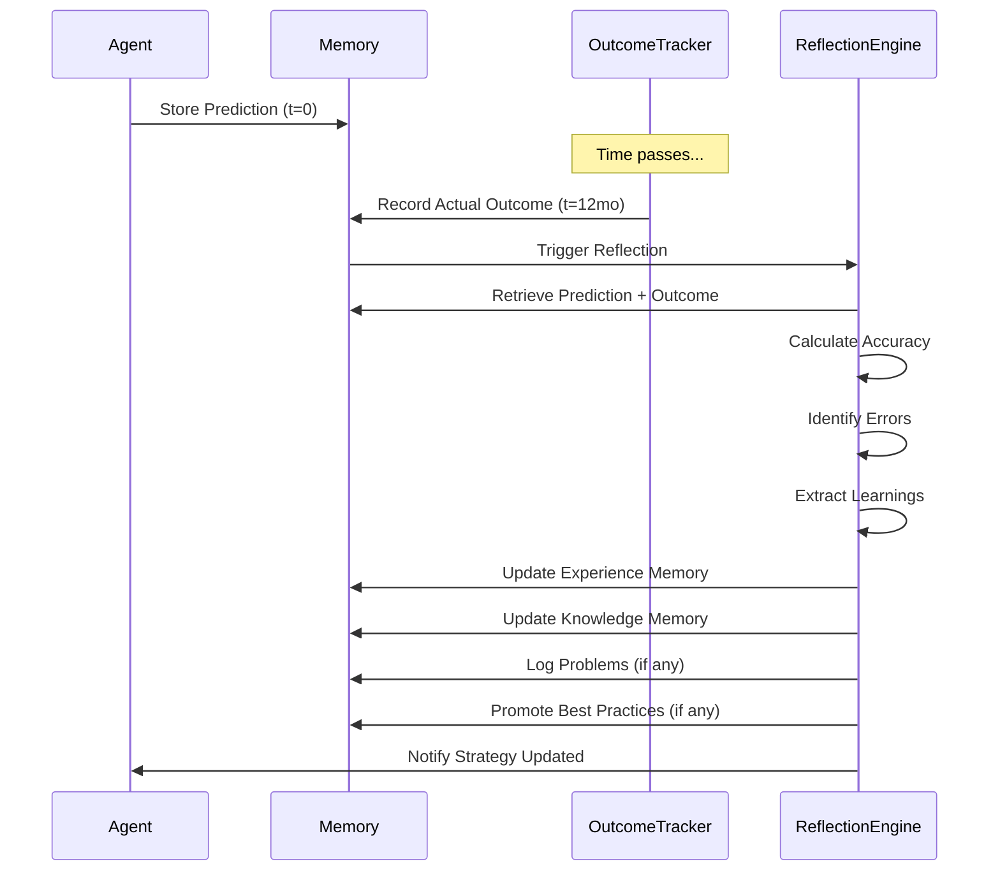
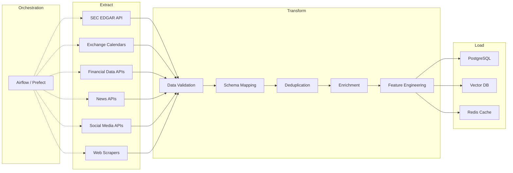

# IPO Intelligence Agent - Project Specification

## Project Overview

**Project Name:** IPO Intelligence Agent  
**Version:** 1.0.0  
**Status:** Design Phase  

### Vision

Build an autonomous AI agent that analyzes upcoming IPOs from global markets and provides investment intelligence by collecting, processing, and reasoning over financial, market, company, and real-world data. The agent operates as a professional financial research analyst with long-term memory and continuous learning capabilities.

### Problem Statement

- Retail investors lack access to institutional-grade IPO research
- Manual IPO analysis is time-consuming and prone to cognitive biases
- Existing tools provide data but not intelligent synthesis or predictive reasoning
- No existing system maintains persistent learning across IPO cycles

### Core Philosophy

> The AI agent provides **deep research-based insights** — not blind recommendations. Every analysis includes:
> - Why an IPO could be profitable (bull case)
> - Why an IPO could fail (bear case)
> - Quantified risk assessment
> - Transparent reasoning traceable to source data

---

## Core Objectives

| # | Objective | Description |
|---|-----------|-------------|
| 1 | **IPO Discovery** | Automatically identify upcoming IPOs globally |
| 2 | **Multi-Source Data Collection** | Aggregate financial, market, sentiment, and alternative data |
| 3 | **Multi-Agent Analysis** | Specialized agents for fundamental, market, risk, sentiment analysis |
| 4 | **Predictive Scoring** | 0-100 IPO score with weighted factor breakdown |
| 5 | **Report Generation** | Structured investment research reports with bull/bear cases |
| 6 | **Persistent Memory** | Long-term learning from predictions vs. outcomes |
| 7 | **Continuous Improvement** | Reflection loops that update agent behavior |

---

## System Architecture

### High-Level Architecture



### Agent Communication Flow



---

## Database Design

### PostgreSQL Schema (Structured Data)



### Vector Database Schema (Memory & Embeddings)

```mermaid
erDiagram
    VECTOR_MEMORY ||--o{ EMBEDDING : contains
    VECTOR_MEMORY {
        string collection_name
        string id PK
        vector embedding
        jsonb metadata
        text document
        timestamp created_at
    }
    
    Collections:
    - ipo_analyses: Full analysis embeddings for semantic search
    - company_profiles: Company descriptions for similarity matching
    - market_patterns: Historical market behavior patterns
    - risk_scenarios: Known risk patterns and outcomes
    - successful_strategies: Proven analysis methodologies
    - failed_predictions: Mistakes for avoidance learning
```

### Redis Schema (Cache & Queue)

```
Keys:
- ipo:discovery:queue          # Bull queue for IPO discovery jobs
- ipo:collection:queue         # Bull queue for data collection jobs
- ipo:analysis:queue           # Bull queue for analysis jobs
- ipo:report:queue             # Bull queue for report generation
- cache:ipo:{symbol}           # Cached IPO data (TTL: 1hr)
- cache:analysis:{ipo_id}      # Cached analysis (TTL: 24hr)
- cache:company:{symbol}       # Cached company profile (TTL: 6hr)
- rate_limit:{api_key}         # API rate limiting
- session:{session_id}         # WebSocket session data
```

---

## AI Agent Specifications

### Agent Definitions

| Agent | Role | Input | Output | Tools |
|-------|------|-------|--------|-------|
| **Discovery Agent** | Find upcoming IPOs | Exchange calendars, SEC filings, news | IPO candidate list | Web scraping, API clients, RSS feeds |
| **Collection Agent** | Gather multi-source data | IPO symbol | Raw data package | Financial APIs, news APIs, web scrapers, SEC EDGAR |
| **Fundamental Analysis Agent** | Analyze financial health | Financial statements, ratios | Score (0-100) + reasoning | LLM + financial reasoning prompts, calculation tools |
| **Market Opportunity Agent** | Assess market potential | Industry data, TAM, competition | Score (0-100) + reasoning | LLM + market research tools, industry databases |
| **Risk Analysis Agent** | Identify risk factors | All collected data | Risk score + factor list | LLM + risk framework, scenario modeling |
| **Sentiment Analysis Agent** | Gauge market psychology | News, social, analyst reports | Sentiment score + signals | NLP models, social listening APIs |
| **Memory Management Agent** | Store/retrieve experience | Analysis results, outcomes | Updated memory | Vector DB, PostgreSQL, embedding model |
| **Report Generation Agent** | Create investment reports | All agent outputs | Structured report | LLM + report templates |
| **Decision Support Agent** | Synthesize final recommendation | All scores + memory context | Overall score + strategy | LLM + decision framework |

### Agent State Machine (LangGraph)



---

## IPO Scoring Framework

### Weighted Scoring Model

```
OVERALL_SCORE = Σ (Factor_Score × Weight)

Factor Weights:
├── Financial Strength (25%)
│   ├── Revenue Quality & Growth (30%)
│   ├── Profitability Metrics (25%)
│   ├── Balance Sheet Health (25%)
│   └── Cash Flow Strength (20%)
├── Growth Potential (25%)
│   ├── Revenue Growth Trajectory (35%)
│   ├── Market Expansion Opportunity (30%)
│   ├── Product Pipeline (20%)
│   └── Scalability (15%)
├── Market Opportunity (20%)
│   ├── TAM/SAM/SOM (30%)
│   ├── Competitive Position (25%)
│   ├── Industry Tailwinds (25%)
│   └── Barriers to Entry (20%)
├── Management Quality (15%)
│   ├── Track Record (30%)
│   ├── Alignment & Incentives (25%)
│   ├── Governance (25%)
│   └── Team Depth (20%)
└── Risk Level (15%) [Inverted - lower risk = higher score]
    ├── Financial Risk (25%)
    ├── Market Risk (25%)
    ├── Regulatory Risk (20%)
    ├── Execution Risk (15%)
    └── Key Person Risk (15%)
```

### Score Interpretation

| Score Range | Classification | Action Guidance |
|-------------|----------------|-----------------|
| 90-100 | **Exceptional Opportunity** | Strong conviction; consider significant allocation |
| 70-89 | **Strong Opportunity** | Favorable risk/reward; standard allocation |
| 50-69 | **Moderate Risk** | Conditional; requires specific catalysts |
| 30-49 | **High Risk** | Speculative only; minimal allocation |
| 0-29 | **Avoid** | Unfavorable risk/reward; do not invest |

---

## Memory Architecture

### Memory Types



### Memory Operations

| Operation | Trigger | Description |
|-----------|---------|-------------|
| **Store Experience** | Analysis complete | Save prediction, reasoning, confidence |
| **Retrieve Similar** | New IPO analysis | Semantic search for comparable cases |
| **Record Outcome** | Outcome known | Link prediction to actual result |
| **Reflect & Learn** | Outcome recorded | Compare prediction vs reality, extract lessons |
| **Update Knowledge** | Pattern confirmed | Add validated patterns to knowledge base |
| **Log Problem** | Error/failure detected | Record issue, root cause, solution |
| **Promote Best Practice** | Repeated success | Codify successful methodology |

### Reflection Loop



---

## API Design

### REST Endpoints

```yaml
openapi: 3.0.0
info:
  title: IPO Intelligence Agent API
  version: 1.0.0
servers:
  - url: https://api.ipo-intelligence.ai/v1

paths:
  /ipos:
    get:
      summary: List upcoming IPOs
      parameters:
        - name: status
          in: query
          schema:
            type: string
            enum: [upcoming, filed, priced, listed, withdrawn]
        - name: sector
          in: query
          schema:
            type: string
        - name: min_score
          in: query
          schema:
            type: integer
            minimum: 0
            maximum: 100
        - name: limit
          in: query
          schema:
            type: integer
            default: 20
      responses:
        '200':
          description: Paginated IPO list

  /ipos/{symbol}:
    get:
      summary: Get IPO details
      parameters:
        - name: symbol
          in: path
          required: true
          schema:
            type: string
      responses:
        '200':
          description: IPO with company, financials, timeline

  /ipos/{symbol}/analysis:
    get:
      summary: Get/latest AI analysis
      parameters:
        - name: symbol
          in: path
          required: true
          schema:
            type: string
        - name: version
          in: query
          schema:
            type: string
      responses:
        '200':
          description: Complete analysis with scores, reasoning, report

  /ipos/{symbol}/analysis:
    post:
      summary: Trigger new analysis
      parameters:
        - name: symbol
          in: path
          required: true
          schema:
            type: string
      requestBody:
        content:
          application/json:
            schema:
              type: object
              properties:
                force_refresh:
                  type: boolean
                  default: false
                depth:
                  type: string
                  enum: [standard, deep, comprehensive]
                  default: standard
      responses:
        '202':
          description: Analysis job queued
          content:
            application/json:
              schema:
                type: object
                properties:
                  job_id:
                    type: string
                  status:
                    type: string

  /analysis/{job_id}:
    get:
      summary: Check analysis job status
      responses:
        '200':
          description: Job status and result when complete

  /search:
    get:
      summary: Natural language IPO search
      parameters:
        - name: q
          in: query
          required: true
          schema:
            type: string
      responses:
        '200':
          description: Ranked IPO matches with snippets

  /chat:
    post:
      summary: Conversational IPO research
      requestBody:
        content:
          application/json:
            schema:
              type: object
              properties:
                message:
                  type: string
                session_id:
                  type: string
                context:
                  type: object
      responses:
        '200':
          description: AI response with citations

  /memory/experiences:
    get:
      summary: Query agent experience memory
      parameters:
        - name: query
          in: query
          schema:
            type: string
        - name: min_accuracy
          in: query
          schema:
            type: number
      responses:
        '200':
          description: Relevant past experiences

  /health:
    get:
      summary: Health check
      responses:
        '200':
          description: Service status
```

### WebSocket Events

```typescript
// Client -> Server
interface ClientEvents {
  'subscribe:ipo': { symbol: string }
  'unsubscribe:ipo': { symbol: string }
  'chat:message': { message: string; session_id: string }
  'analysis:progress': { job_id: string }
}

// Server -> Client
interface ServerEvents {
  'ipo:update': IPOUpdate
  'analysis:progress': { job_id: string; stage: string; progress: number }
  'analysis:complete': AnalysisResult
  'chat:response': ChatResponse
  'alert:score_change': { symbol: string; old_score: number; new_score: number }
  'alert:new_ipo': IPO
}
```

---

## Data Pipeline

### ETL Architecture



### Data Sources

| Category | Sources | Frequency | Method |
|----------|---------|-----------|--------|
| **IPO Calendar** | NASDAQ, NYSE, LSE, HKEX, BSE, SEC EDGAR | Real-time | API + Webhook |
| **Financial Statements** | SEC EDGAR, S&P Capital IQ, FactSet, Company IR | Quarterly | API + Scraping |
| **Market Data** | Yahoo Finance, Alpha Vantage, Polygon.io | Real-time | WebSocket + API |
| **News** | Bloomberg, Reuters, Financial Times, Seeking Alpha | Real-time | News API + RSS |
| **Analyst Reports** | TipRanks, MarketBeat, Institutional research | Daily | API + Partnerships |
| **Social Sentiment** | Twitter/X, Reddit, StockTwits, LinkedIn | Real-time | Social APIs |
| **Alternative Data** | App store rankings, web traffic, hiring data, satellite | Weekly | Specialized providers |

---

## Development Roadmap

### Phase 1: Foundation (Weeks 1-4)
**Goal:** Basic IPO data collection and storage

| Task | Description | Deliverable |
|------|-------------|-------------|
| 1.1 | Project setup, CI/CD, dev environment | Repo with linting, testing, Docker |
| 1.2 | PostgreSQL schema + migrations | Running database with all tables |
| 1.3 | Redis + Vector DB setup | Connected storage services |
| 1.4 | IPO Discovery Agent (SEC + 3 exchanges) | Automated IPO detection |
| 1.5 | Basic Collection Agent (financials + news) | Raw data pipeline |
| 1.6 | ETL orchestration (Prefect) | Scheduled data refresh |

### Phase 2: Analysis Engine (Weeks 5-8)
**Goal:** Multi-agent financial analysis

| Task | Description | Deliverable |
|------|-------------|-------------|
| 2.1 | Fundamental Analysis Agent | Financial health scoring |
| 2.2 | Market Opportunity Agent | TAM/competition analysis |
| 2.3 | Risk Analysis Agent | Risk factor identification |
| 2.4 | Sentiment Analysis Agent | News/social sentiment scoring |
| 2.5 | Scoring framework implementation | Weighted 0-100 score |
| 2.6 | LangGraph orchestration | End-to-end analysis workflow |

### Phase 3: Intelligence & Memory (Weeks 9-12)
**Goal:** Learning system and report generation

| Task | Description | Deliverable |
|------|-------------|-------------|
| 3.1 | Memory Management Agent | Experience/Problem/Knowledge storage |
| 3.2 | Vector memory integration | Semantic search over history |
| 3.3 | Reflection engine | Prediction vs outcome comparison |
| 3.4 | Report Generation Agent | Structured investment reports |
| 3.5 | Decision Support Agent | Final synthesis + strategy |
| 3.6 | Memory-driven analysis | Historical context in new analysis |

### Phase 4: API & Interface (Weeks 13-16)
**Goal:** Production API and dashboard

| Task | Description | Deliverable |
|------|-------------|-------------|
| 4.1 | FastAPI REST API | All endpoints implemented |
| 4.2 | WebSocket real-time updates | Live analysis progress |
| 4.3 | Authentication & rate limiting | Secure multi-tenant API |
| 4.4 | React/Next.js Dashboard | IPO list, analysis view, chat |
| 4.5 | Natural language search | Semantic IPO discovery |
| 4.6 | Conversational interface | Chat with agent about IPOs |

### Phase 5: Production Hardening (Weeks 17-20)
**Goal:** Reliability, monitoring, scale

| Task | Description | Deliverable |
|------|-------------|-------------|
| 5.1 | Comprehensive testing | Unit, integration, E2E, load tests |
| 5.2 | Observability stack | Logs, metrics, traces (Grafana/Loki/Tempo) |
| 5.3 | Alerting & on-call | PagerDuty integration |
| 5.4 | Data quality monitoring | Great Expectations / custom checks |
| 5.5 | Model evaluation pipeline | Backtesting framework |
| 5.6 | Documentation & runbooks | Operational guides |

### Phase 6: Advanced Features (Weeks 21+)
**Goal:** Differentiation and scale

| Feature | Description |
|---------|-------------|
| **Portfolio Integration** | Connect brokerage accounts for personalized analysis |
| **Custom Alerts** | User-defined triggers (score changes, new IPOs) |
| **Analyst Collaboration** | Human-in-the-loop verification workflow |
| **Multi-language Support** | Global market coverage |
| **Regulatory Compliance** | SEC/FINRA compliance features |
| **White-label API** | B2B offering for financial institutions |

---

## Technical Stack

### Backend
| Component | Technology | Version |
|-----------|------------|---------|
| Language | Python | 3.12+ |
| API Framework | FastAPI | 0.110+ |
| Agent Orchestration | LangGraph | 0.2+ |
| LLM Framework | LangChain | 0.2+ |
| Database | PostgreSQL | 16+ |
| Vector DB | pgvector / Pinecone / Weaviate | Latest |
| Cache/Queue | Redis | 7+ |
| Task Queue | BullMQ / Celery | Latest |
| ETL Orchestration | Prefect | 3+ |
| Monitoring | OpenTelemetry + Grafana | Latest |

### AI/ML
| Component | Technology |
|-----------|------------|
| Primary LLM | GPT-4o / Claude 3.5 Sonnet / Local (Llama 3.1) |
| Embeddings | text-embedding-3-large / BGE-M3 |
| Financial Reasoning | Fine-tuned models / RAG with financial corpus |
| NLP | spaCy / transformers |

### Frontend
| Component | Technology |
|-----------|------------|
| Framework | Next.js 14+ (App Router) |
| Language | TypeScript 5+ |
| Styling | Tailwind CSS + shadcn/ui |
| State | TanStack Query + Zustand |
| Real-time | Socket.io client |
| Charts | Recharts / TradingView Lightweight Charts |

### Infrastructure
| Component | Technology |
|-----------|------------|
| Container | Docker + Docker Compose |
| Orchestration | Kubernetes (EKS/GKE) |
| CI/CD | GitHub Actions |
| Secrets | HashiCorp Vault / AWS Secrets Manager |
| DNS/SSL | Cloudflare |
| Object Storage | S3 / R2 |

---

## Safety & Limitations

### Disclaimer Framework

Every report includes:

```
⚠️ IMPORTANT DISCLAIMER

This analysis is generated by an AI system for research purposes only.
It does not constitute financial advice, investment recommendations, 
or an offer to buy/sell securities.

Key Limitations:
- Predictions are probabilistic, not guaranteed
- Past performance ≠ future results
- Model may hallucinate or misinterpret data
- Data sources may contain errors or delays
- Market conditions change rapidly

Always:
- Verify critical data independently
- Consult qualified financial advisors
- Consider your risk tolerance
- Never invest more than you can afford to lose

The AI agent's track record is transparent and available for review.
```

### Risk Mitigation

| Risk | Mitigation |
|------|------------|
| Hallucination | Citation-required outputs; source verification |
| Data staleness | Real-time feeds + freshness indicators |
| Bias in training | Diverse data sources; adversarial testing |
| Overconfidence | Uncertainty quantification; confidence intervals |
| Regulatory | No personalized advice; clear disclaimers |
| Model drift | Continuous evaluation; automated retraining triggers |

---

## Future Improvements

### Near-term (3-6 months)
- [ ] Fine-tuned financial reasoning model
- [ ] Real-time options flow analysis for post-IPO
- [ ] SPAC and direct listing support
- [ ] Crypto token launch analysis
- [ ] ESG scoring integration

### Medium-term (6-12 months)
- [ ] Multi-modal analysis (earnings call transcripts, video)
- [ ] Causal inference for driver identification
- [ ] Counterfactual simulation engine
- [ ] Institutional order flow integration
- [ ] Global regulatory filing parser (non-US)

### Long-term (12+ months)
- [ ] Autonomous portfolio construction
- [ ] Market-making simulation for liquidity analysis
- [ ] Cross-asset correlation modeling
- [ ] Decentralized validation network
- [ ] AI-generated alpha factor discovery

---

## Success Metrics

### Technical KPIs
| Metric | Target |
|--------|--------|
| Analysis latency (standard) | < 30 seconds |
| Analysis latency (deep) | < 3 minutes |
| Data freshness | < 15 minutes for market data |
| Uptime | 99.9% |
| API p99 latency | < 500ms |

### Quality KPIs
| Metric | Target |
|--------|--------|
| Prediction accuracy (12mo) | > 65% directional |
| Calibration error | < 0.1 Brier score |
| User satisfaction (NPS) | > 50 |
| Report usefulness rating | > 4.5/5 |
| False positive rate (high score → loss) | < 20% |

### Business KPIs
| Metric | Target |
|--------|--------|
| Active users (MAU) | 10,000+ by month 12 |
| Paid conversion | > 15% |
| Churn rate | < 5% monthly |
| API calls/day | 1M+ by month 12 |

---

## Appendix: Glossary

| Term | Definition |
|------|------------|
| **IPO** | Initial Public Offering - first sale of stock by a private company to the public |
| **TAM/SAM/SOM** | Total/Serviceable/Obtainable Market |
| **EDGAR** | SEC's Electronic Data Gathering, Analysis, and Retrieval system |
| **RAG** | Retrieval-Augmented Generation |
| **LLM** | Large Language Model |
| **Vector DB** | Database optimized for similarity search on embeddings |
| **LangGraph** | Framework for building stateful, multi-agent LLM applications |
| **Bull/Bear Case** | Optimistic/pessimistic investment thesis |
| **Calibration** | Alignment between predicted probabilities and actual frequencies |
| **Brier Score** | Proper scoring rule for probabilistic predictions |

---

*Document Version: 1.0.0*  
*Last Updated: 2026-07-18*  
*Classification: Internal - Confidential*